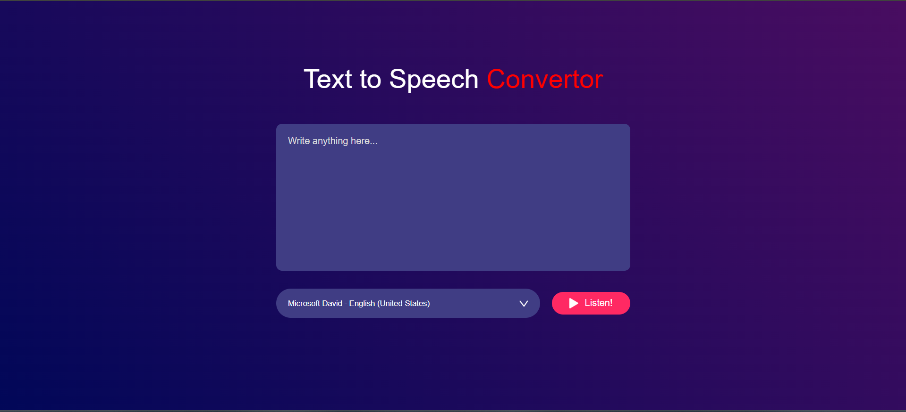

# 🗣️ Text-to-Speech Converter

A beginner-friendly Text-to-Speech (TTS) web application built using **HTML**, **CSS**, and **JavaScript**.  
It allows users to input text and listen to it spoken aloud using the browser's **Web Speech API**.  
This project is a great way to explore web APIs and build accessible, interactive web tools.

---

## 🚀 Features
- Convert written text into speech instantly
- Simple and clean user interface
- Built entirely with vanilla HTML, CSS, and JavaScript
- Works directly in modern web browsers

---

## 📸 Project Preview

---

## 🛠️ Technologies Used

---
